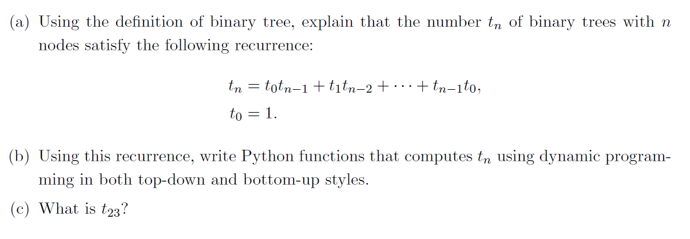

## 알고리즘분석(배교수님) HW 2

트리의 노드 수가 주어지면 가능한 트리의 경우의 수를 구하는 문제.  
DP를 이용해 top-down과 bottom-up 두 가지 방식의 함수를 만들었다.  
함수의 모양은 과제에 올려주신 이항계수를 구하는 함수를 참고했다.  
hw2()는 주어진 공식 그대로 재귀함수를 이용해서 작성해뒀고,  
top-down 방식은 hw2()에서 만든 모양에 데코레이터 함수를 이용해서 해당 값이 기존의 배열에 없을 때에만 계산하도록 바꿔주었다.  
bottom-up 방식은 배열을 먼저 만들어 두고, 이중 반복문을 이용해 n에 도달할 때까지 값을 계산하도록 했다.  

처음 파이썬을 써 본 문제였는데 파이썬이 과연 쉽긴 하다고 느꼈다...  
C/C++이었다면 신경써줘야 할 부분들을 전혀 신경 안 쓰고 그대로 작성했는데도 문제가 금방 풀렸다. DP를 구현하는 식은 과제에 포함되어 있어서 구할 필요가 없어 쉬웠음.