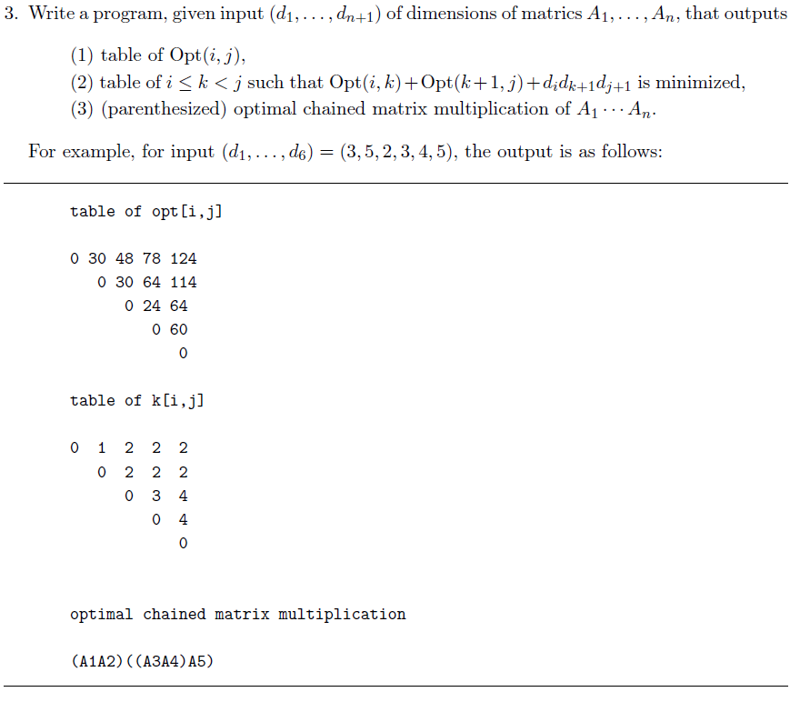
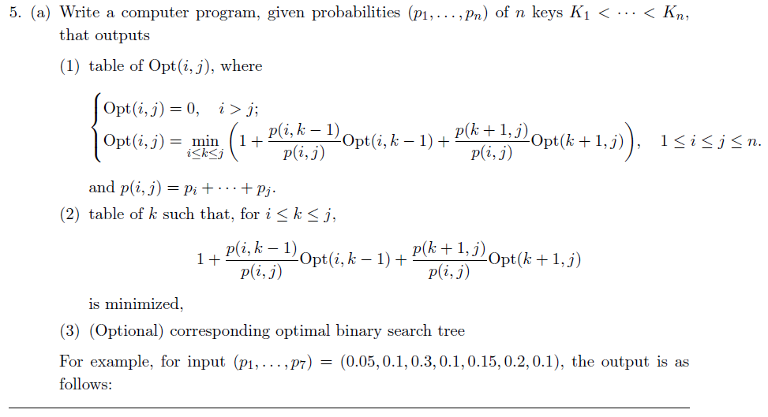
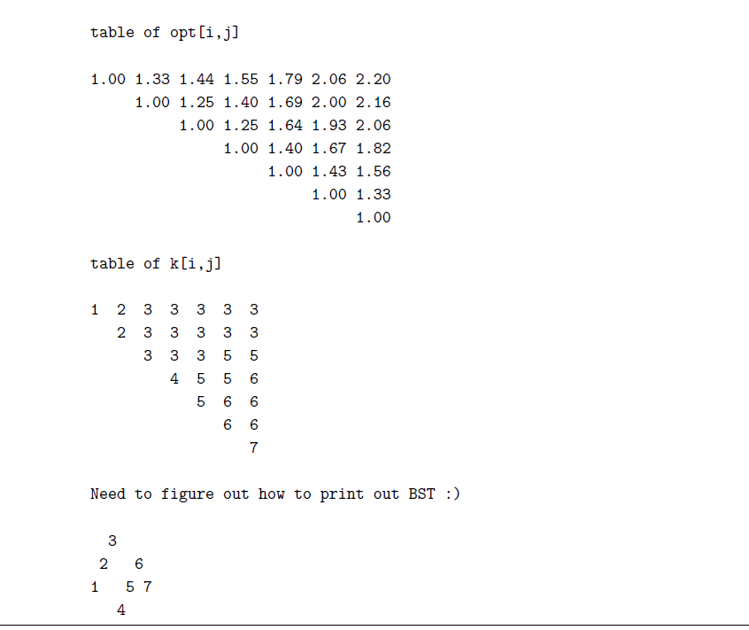

## 알고리즘분석(배교수님) HW 2

최적의 행렬 곱셈 순서를 구하는 문제.  
여기서도 필요한 식은 다 주어졌으나 구현하기가 은근 까다로웠다.  
최적의 곱셈 횟수를 저장하는 Opt와 이 최소값이 될 때의 k값을 저장하는 배열을 만들고, bottom-up 방식으로 삼중 반복문을 통해 배열을 채워나갔다. k값을 따라가는 마지막 반복문에서 조건문으로 최소값이 될 때의 cost와 k값을 저장하는 배열을 만들었다.  
pr과 pr2는 출력을 위한 함수.

5번 문제는 각 노드의 탐색 확률이 주어졌을 때 최적의 이진 탐색 트리를 구하는 문제였다.  
bottom-up 방식으로 만들려니 k-1과 k+1이 동시에 나오는 부분을 어떻게 처리해야 할 지 모르겠어서 식 정의 그대로 재귀함수를 만들고, 조금씩 덧붙여가며 top-down 방식의 dp 코드를 작성했다.  
우선 필요한 배열을 만들어두고 초기값을 모두 inf로 초기화한 다음, 찾는 값이 inf가 아닐 경우에만 계산을 하도록 했다.  

### 후기
1. 2차원 dp로 바뀌었을 뿐인데 지난주에 썼던 코드를 그대로 재활용할 수 없었다. 어렵다.
2. 파이썬이나 씨쁠쁠이나 인덱스 +-1 차이가 은근 까다롭고 시간을 많이 잡아먹는다... 이렇게 하면 맞겠지 하고 실행해보면 틀림. 연습을 많이 해봐야 늘 것 같다.
3. 파이썬이 씨쁠쁠보다 에러메시지가 불친절한 것 같다. VSCode만 써서 그런가? 다른 IDE 사용하면 달라지나요?
4. 배알골 너무 힘듭니다. 듣지마세요..